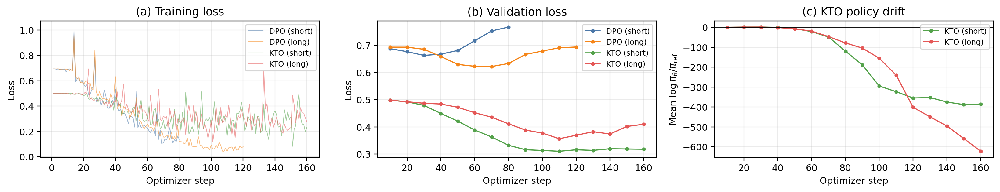

# LaughTuned

Fine-tuning Mistral-7B-Instruct for comedy writing on Guardian news
articles, using DPO and KTO preference optimization implemented from
scratch in PyTorch.

The writeup ([report/main.pdf](report/main.pdf)) covers the full method,
training dynamics, and a failure analysis of KTO's bounded loss masking
policy drift.

## Key findings

- **Context length matters as much as the algorithm.** Under identical
  hyperparameters, *short*-context fine-tuning improved both algorithms
  over the base model (62% cross-judge win rate), while *long*-context
  fine-tuning (today's article + a model-generated historical
  backstory) made both *worse* than base (47%).
- **DPO and KTO swap places by context.** DPO beats KTO head-to-head
  on short (59–41); KTO beats DPO on long (60–40). Algorithm choice
  isn't independent of context-length choice.
- **KTO's val loss can lie.** Both KTO runs reached lower val loss than
  either DPO run, yet the cross-judge ranked them no better. The
  policy-vs-reference log-ratio collapsed to ~−400 (short) and ~−600
  (long) while the bounded loss never registered the drift. The fix:
  monitor the log-ratio, not just the loss.



## Repo layout

```
.
├── config.py                  # Hyperparameters and paths
├── data/
│   ├── fetch_articles.py      # Guardian API ingestion + historical backstories
│   ├── build_prompts.py       # Comedy-prompt construction (short/long variants)
│   ├── generate_pairs.py      # Base-Mistral paired sampling
│   ├── judge.py               # Claude rubric judging (DPO + KTO labels)
│   └── prepare_datasets.py    # Tokenization, splits, DataLoaders
├── models/
│   ├── load_model.py          # QLoRA model loading
│   ├── log_probs.py           # compute_log_probs primitive
│   ├── dpo.py                 # DPO loss (from scratch)
│   ├── kto.py                 # KTO loss (from scratch)
│   ├── ref_log_probs.py       # Cached reference log-probs
│   └── train.py               # Shared training loop
├── eval/
│   ├── generate_eval.py       # Held-out generation per variant
│   ├── judge_eval.py          # Rank-3 cross-judge
│   └── metrics.py             # Perplexity + BERTScore
├── utils/                     # Drive, logging, checkpointing
├── demo.ipynb                 # Colab-runnable pipeline (executable)
├── demo_colab_output.ipynb    # The above with outputs from the actual run
├── report/                    # CVPR-format writeup (LaTeX + PDF)
└── requirements.txt
```

## Running on Colab

1. Open [`demo.ipynb`](demo.ipynb) in Colab. (A100 strongly recommended;
   end-to-end is ~3 hours on A100, longer on T4.)
2. The first cell clones this repo into `/content/laughtuned`, installs
   `requirements.txt`, mounts Google Drive, and creates the artifact
   tree under `/content/drive/MyDrive/LaughTuned/`.
3. Add three Colab secrets (left sidebar → 🔑 *Secrets*):
   `GUARDIAN_API_KEY`, `GUARDIAN_API_KEY_2` (optional second key for
   higher Guardian rate limit), and `ANTHROPIC_API_KEY`.
4. Run cells top-to-bottom. Every long-running stage (Guardian
   ingestion, paired generation, judging, ref-logprob caching, and the
   four training runs) is **idempotent and resume-friendly** — re-running
   a cell after an interruption picks up from disk.

Cost estimate for a full run from scratch:

| Stage | Time on A100 | API cost |
|---|---|---|
| Article ingestion (502 articles + backstories) | ~30 min | ~$3 |
| Pair generation (470 prompts × 2 ctx × 2 samples) | ~45 min | — |
| Rubric judging (940 pairs) | ~30 min | ~$9 |
| Training (4 variants × ~500 steps) | ~2 h | — |
| Eval generation + cross-judge | ~15 min | ~$2 |

## Where the outputs live

Code is in git. Data, checkpoints, metrics, and figures are *not* in
git (too large, often binary) — they live on Google Drive under
`drive_root`:

```
/content/drive/MyDrive/LaughTuned/
├── data/{articles,prompts,generations,preferences,splits,eval}/
├── ref_log_probs/                 # Cached reference model log-probs
├── checkpoints/<experiment_name>/ # LoRA adapter snapshots
├── metrics/<experiment_name>/     # JSONL + TensorBoard event files
└── figures/                       # PNG + PDF outputs for the report
```

Cells in the demo notebook print the exact paths they write to. The
training cell streams losses + diagnostics to TensorBoard live (the
launcher cell above it sets up `%tensorboard`).

## Re-creating report figures

After a training run, the figures used in the writeup can be rebuilt
locally with:

```
python report/figures/build_training_curves.py
python report/figures/build_winrates_figure.py
python report/figures/build_agreement_figure.py
python report/figures/build_kto_logratio_figure.py
python report/figures/build_pipeline_figure.py
```

Each script reads from the appropriate JSONL under `<drive_root>/metrics/`
or `<drive_root>/data/eval/` and writes PNG + PDF to
`report/figures/`. Paths are picked up from `config.py`.

## Type checking

```
pyright
```

Run from the repo root. Configured in `pyrightconfig.json`.
